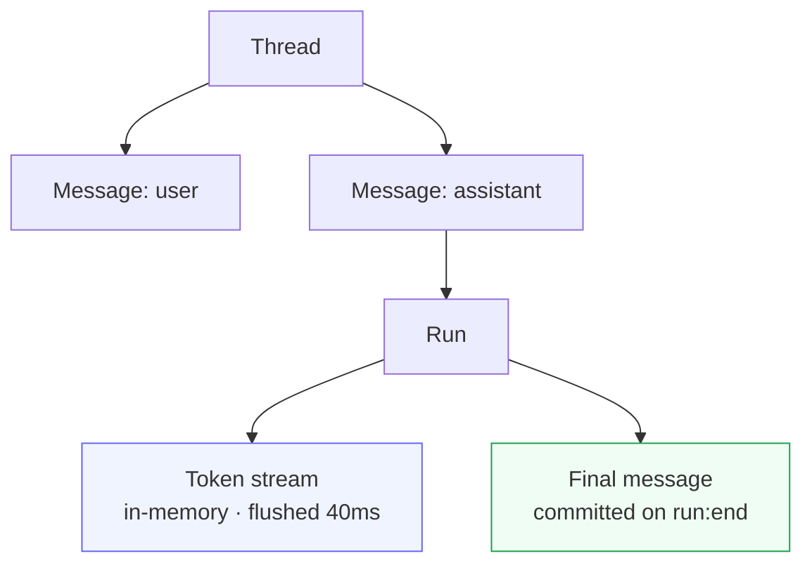
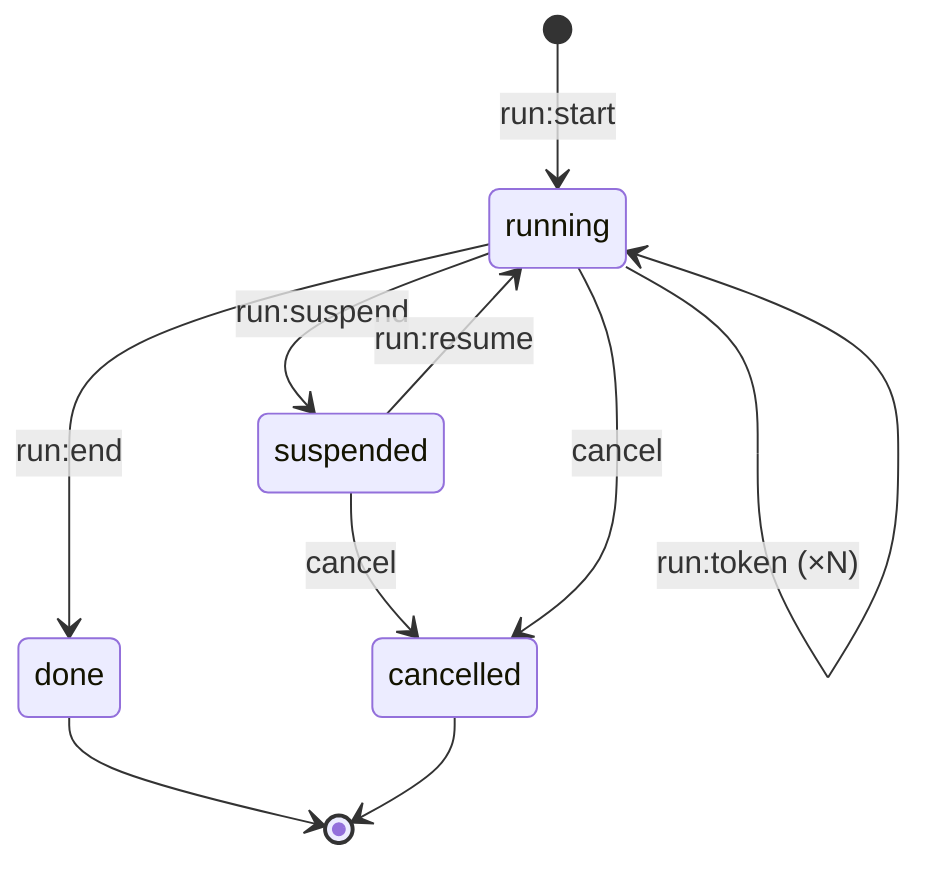

# Chat / Sessions

Durable, real-time messaging for AI agents and human conversations.

## What it is

Chat gives every conversation a persistent **thread** backed by the Durable Objects ring. Messages survive restarts. Token streams from LLMs accumulate in memory and flush to subscribers every 40ms. When a run ends, the final message is committed to the WAL and Postgres.

## Mental model



A **thread** is the durable unit — one WebSocket channel per thread:

```
chat:v1:app:{appKey}:thread:{threadId}
```

A **run** is one LLM generation: it starts, streams tokens, and ends. Token chunks bypass full state serialisation via `set_volatile` — only a tiny log entry is written per flush, not the entire thread state.

## Run lifecycle



## When to use

- AI chat interfaces — customer support, copilots, assistants
- Multi-agent pipelines that need a durable audit log
- Any product with persistent, searchable conversation history

If you only need fast pub/sub without persistence, use [Channels](/docs/sdk/channels) instead.

---

**New here?** Start with the [Quickstart](./cookbook/quickstart) — you'll have a working chat interface in 15 minutes.

**Know what you're looking for?** Jump to the [Reference](./reference/concepts).
