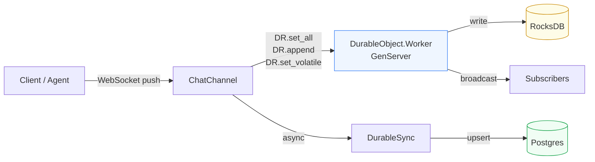
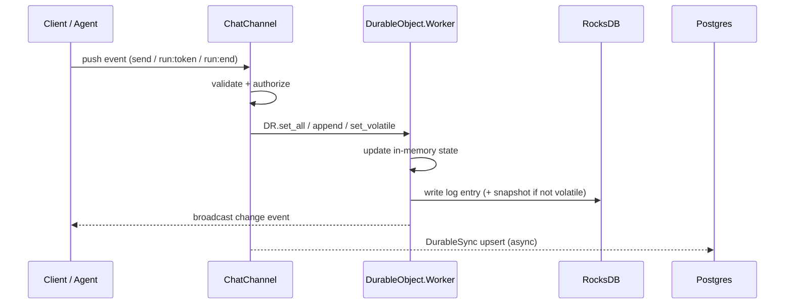
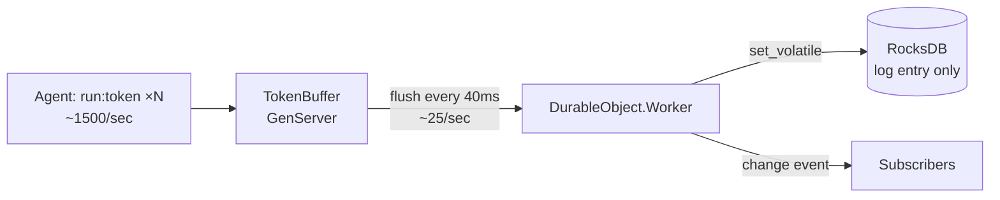
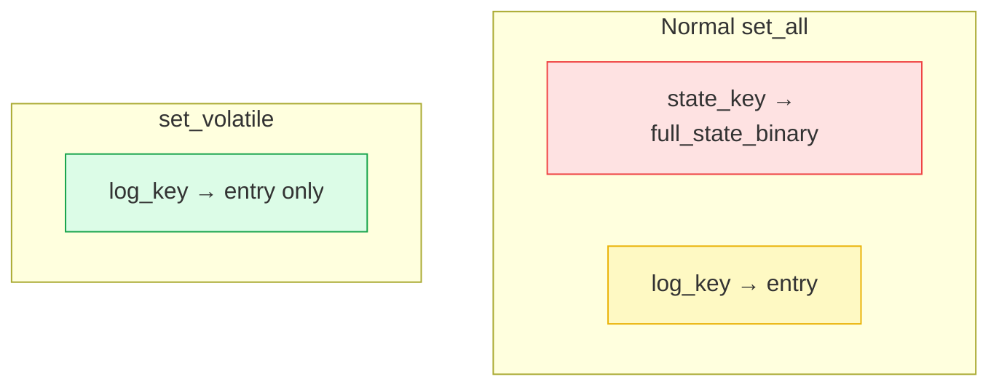
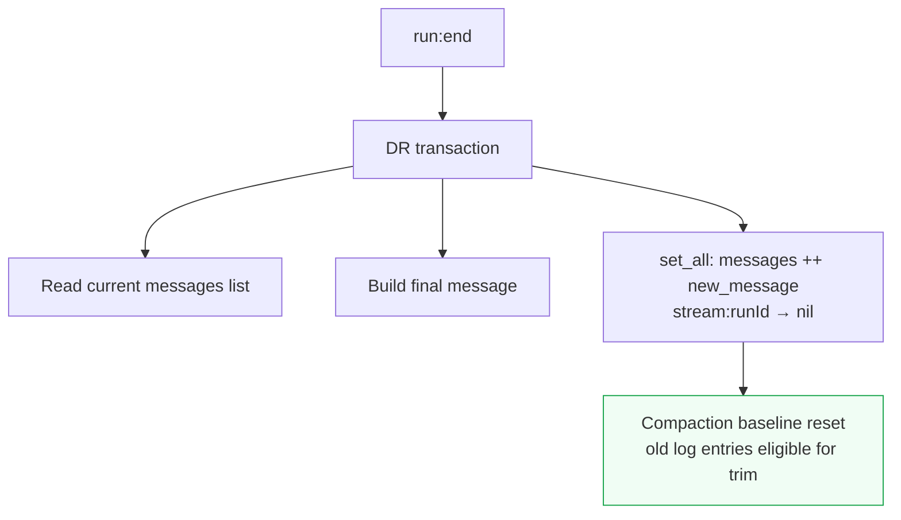
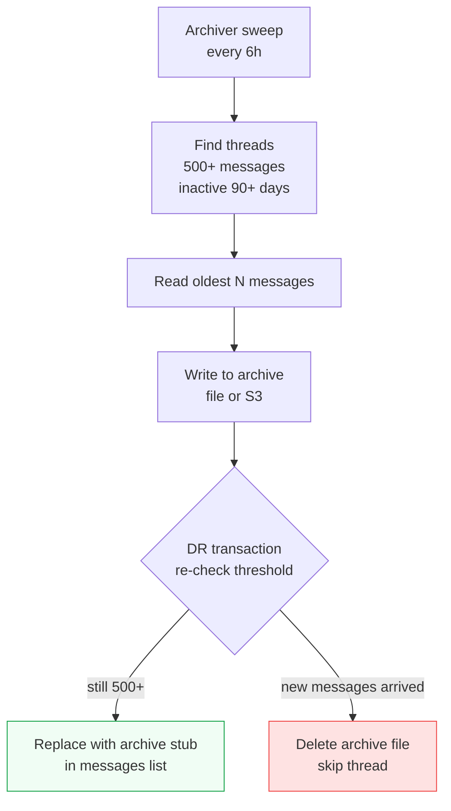
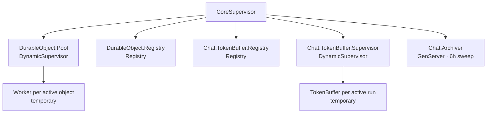

# Architecture

## Storage layer

Chat uses a two-layer storage model:

| Layer | Role | Technology |
|---|---|---|
| **Durable Objects ring** | Real-time source of truth | RocksDB WAL + in-memory state |
| **Postgres** | Search replica, API reads | Standard relational DB |

Postgres is never the primary write target. It is updated asynchronously by `DurableSync` after the WAL write succeeds.

---

## WAL write path

---

## Token streaming and `set_volatile`

LLM agents push tokens at up to 1,500/sec per run. Two optimisations prevent this from saturating RocksDB:

### 1. Token rollup buffer (40ms)

### 2. `set_volatile` vs normal write

At 1,000 concurrent runs × 25 flushes/sec = 25,000 writes/sec. With `set_volatile`, each is a ~200-byte log entry. Without it, each would serialise the entire thread state — potentially MBs per write.

On crash + rehydrate, `set_volatile` log entries replay identically to normal writes. On `run:end` the volatile slot is dropped.

---

## GC compaction

The WAL log grows with every write. Chat compacts on every `run:end`:

`set_all` is atomic — the new state contains everything the preceding log entries represented, so trimming them is safe.

---

## Generational archival

When `load_older` hits a stub it fetches the archive transparently — the client receives a normal page.

---

## Supervision tree

`TokenBuffer` processes are `:temporary` — a crash during streaming is safe. `flush_and_stop` falls back to the last committed value from the Worker's in-memory state.
