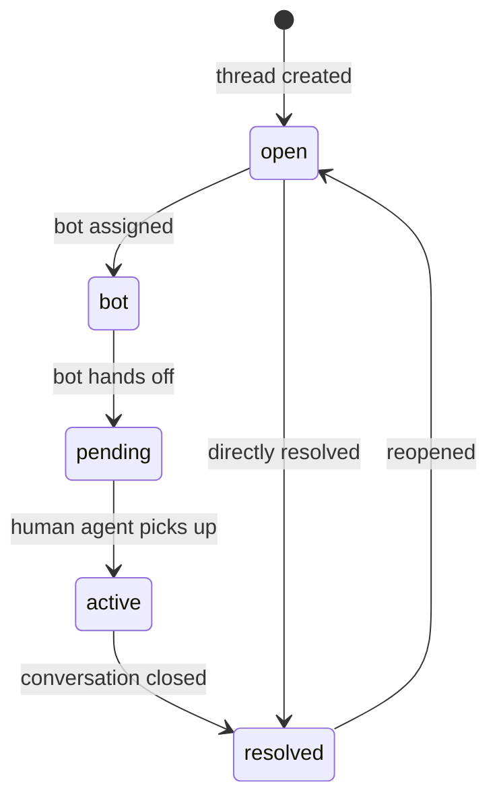
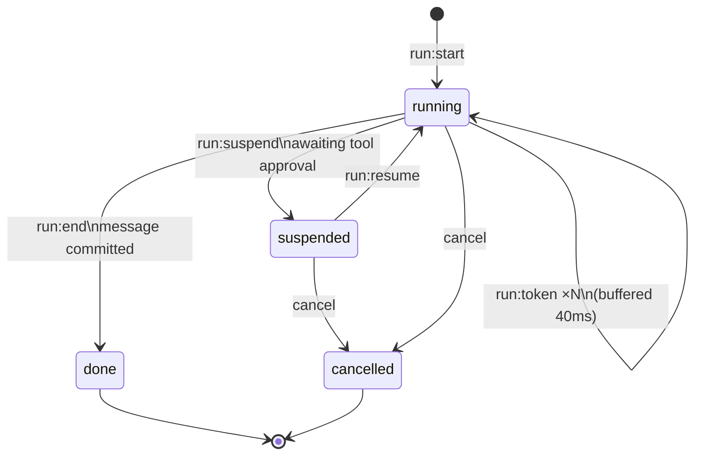
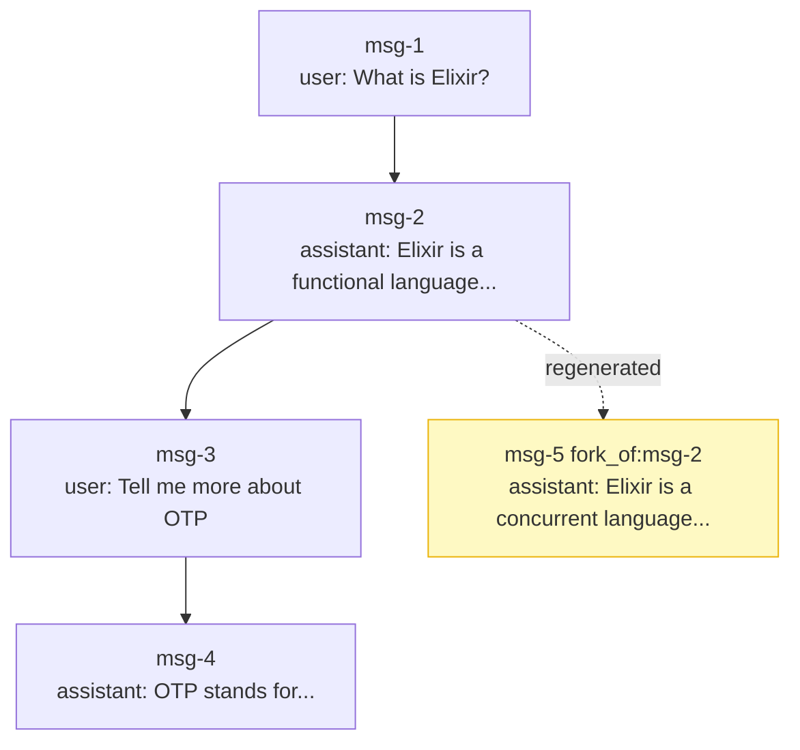
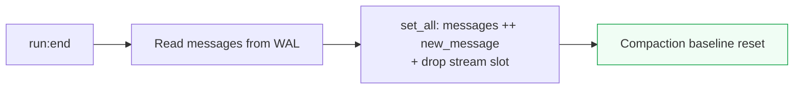
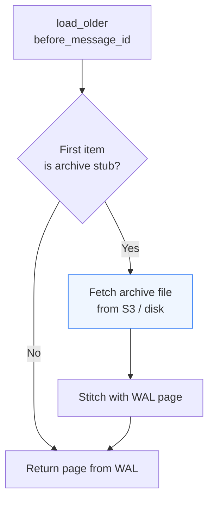

# Core Concepts

## Threads

A thread is the top-level container for a conversation.

| Field | Type | Description |
|---|---|---|
| `id` | UUID | Unique identifier |
| `app_id` | UUID | The Pingerchips app it belongs to |
| `status` | enum | `open` \| `bot` \| `pending` \| `active` \| `resolved` |
| `title` | string? | Optional display title |
| `bot_id` | UUID? | Agent assigned to this thread |
| `assigned_agent` | string? | Human agent handle (post-handoff) |
| `metadata` | map | Arbitrary key-value pairs |

Thread state is stored in the Durable Objects ring and replicated to Postgres. Subscribe via:

```
chat:v1:app:{appKey}:thread:{threadId}
```

### Thread status flow



---

## Messages

| Field | Type | Description |
|---|---|---|
| `id` | UUID | Unique identifier |
| `thread_id` | UUID | Parent thread |
| `role` | string | `user` \| `assistant` \| `tool` \| `system` |
| `content` | map | `{"text": "..."}` or structured content |
| `run_id` | UUID? | The run that produced this message |
| `parent_id` | UUID? | Parent in the conversation tree |
| `fork_of` | UUID? | Original message this was regenerated from |
| `owner_client_id` | string? | Client that sent this message |
| `inserted_at` | ISO 8601 | Creation timestamp |

---

## Runs

A run is one LLM generation cycle.



During streaming, token chunks are buffered in a `TokenBuffer` GenServer and flushed every 40ms to the WAL as a `stream:{runId}` volatile slot. On `run:end` the final message is appended to `messages` and the volatile slot is dropped.

---

## Conversation tree

Messages form a **tree**, not a list. `parent_id` links each message to the one it replies to. `fork_of` links a regenerated message to the original.



When a user regenerates, the server creates a new assistant message with `fork_of` pointing to the original. Both branches exist; the UI decides which to show.

---

## GC compaction

The WAL grows with every write. Chat compacts on every `run:end`:



`set_all` is atomic — all preceding log entries for `messages` can be trimmed safely.

---

## Load older / pagination

`load_older` walks backwards in pages of 50, from a `before_message_id` cursor.



Archive stubs are transparent to the client — it always receives a normal `{ messages, has_older }` page.
