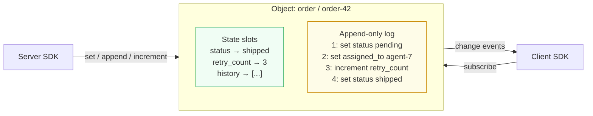

# Durable Objects

Named, persistent key-value entities with real-time subscriptions.

## What it is

A Durable Object is a shared, persistent variable that:
- is addressable from any SDK or HTTP client, anywhere
- serialises concurrent writes automatically — no conflicts possible
- streams every change to all subscribers in real time
- lets processes reconnect and replay what they missed via `afterLogId`

No framework to learn. No classes to extend. No handlers to register.

## Mental model



**State** = materialised view of current slot values (fast reads).
**Log** = source of truth (replayed on restart — no data loss possible).

## Addressing

Objects are identified by `type` and `key` — arbitrary strings, no registration needed:

```
type: "order"     key: "order-42"
type: "run"       key: "run-abc123"
type: "session"   key: "user-99"
```

## When to use

| Use case | Why |
|---|---|
| AI agent run state | Agents write progress; clients see it live |
| Shared working memory | Multiple agents, one serialised object |
| Approval queues | Status changes broadcast in real time |
| Atomic counters | `increment` is always serialised |
| Append-only event logs | `append` builds an ordered audit trail |

[Chat / Sessions](/docs/chat/intro) is built directly on Durable Objects — each thread is an object of type `"thread"`.

---

**New here?** Start with the [Quickstart](./cookbook/quickstart).

**Know what you're looking for?** Jump to [Concepts](./reference/concepts) or the [Server SDK](./reference/server-sdk).
