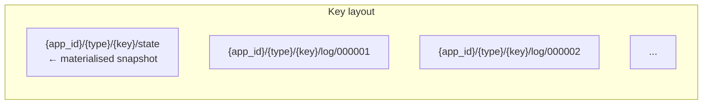
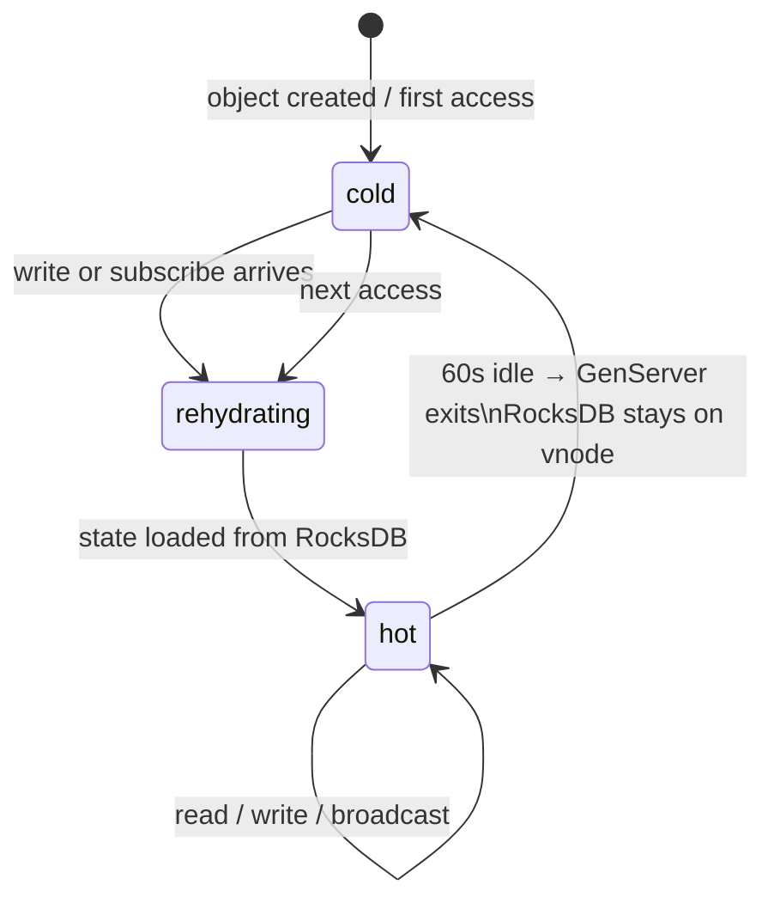
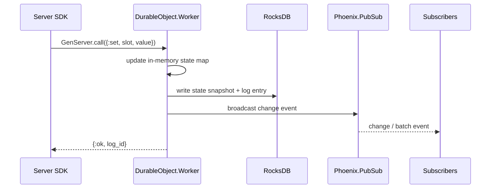
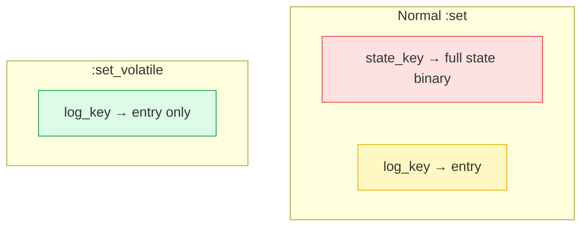
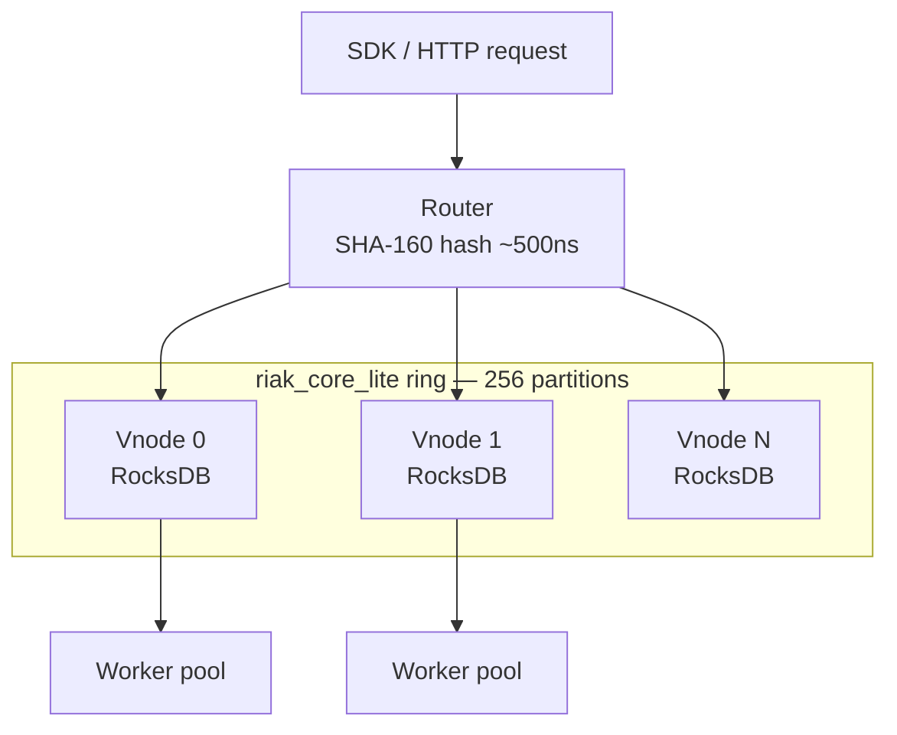
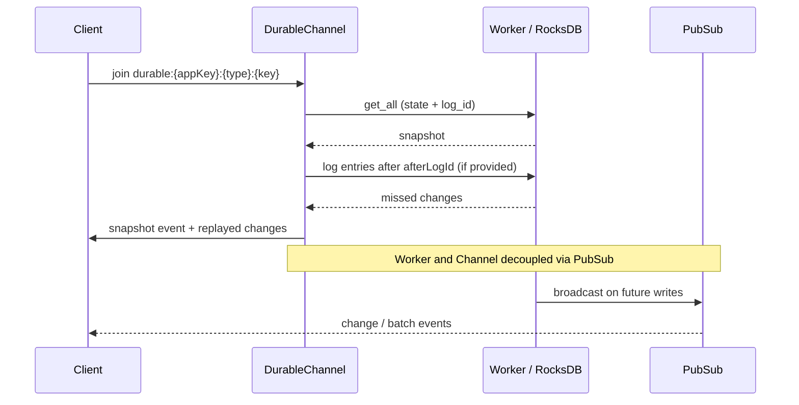
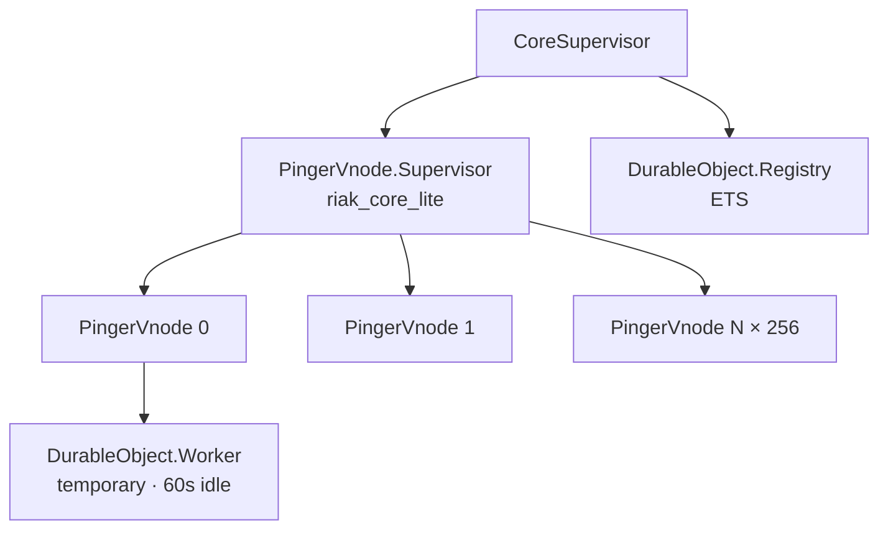

# Architecture

## Storage: RocksDB per vnode

Each object's data lives in an embedded RocksDB instance — in-process, no network hop.

All keys for one object share a prefix — rehydration is a single prefix scan, not a scatter-gather.

| Operation | Mechanism | Latency |
|---|---|---|
| Read (hot) | In-memory map | ~0 ns |
| Read (cold) | RocksDB bloom filter + memtable | ~10 µs |
| Write | Memtable + WAL append | ~50 µs |
| Rehydrate (snapshot) | Single key read | ~10 µs |
| Log replay | Sequential prefix scan | ~1 µs/entry |

---

## DurableObject Worker lifecycle

The Worker serialises all writes — no per-slot locking needed. RocksDB data persists on the vnode regardless of Worker state.

---

## Write path

---

## `set_volatile`: log-only writes

Used internally by Chat token streaming — skips the state snapshot write.

On crash + rehydrate, volatile log entries replay identically to normal writes.

---

## Distribution: riak_core_lite ring

Routing: `partition = SHA-160(app_id <> "/" <> type <> "/" <> key) % 256` — pure arithmetic, ~500ns, no network call.

**Handoff**: when nodes join/leave, the vnode's RocksDB key range streams to the new owner. Object state migrates with the partition.

**Cold reads**: served directly by the vnode from RocksDB — no Worker started, memory proportional to active objects only.

---

## Real-time subscribe flow

---

## Supervision tree

Workers are `:temporary` — not restarted on crash. Next access rehydrates from RocksDB. A crashed Worker is equivalent to an evicted one.
