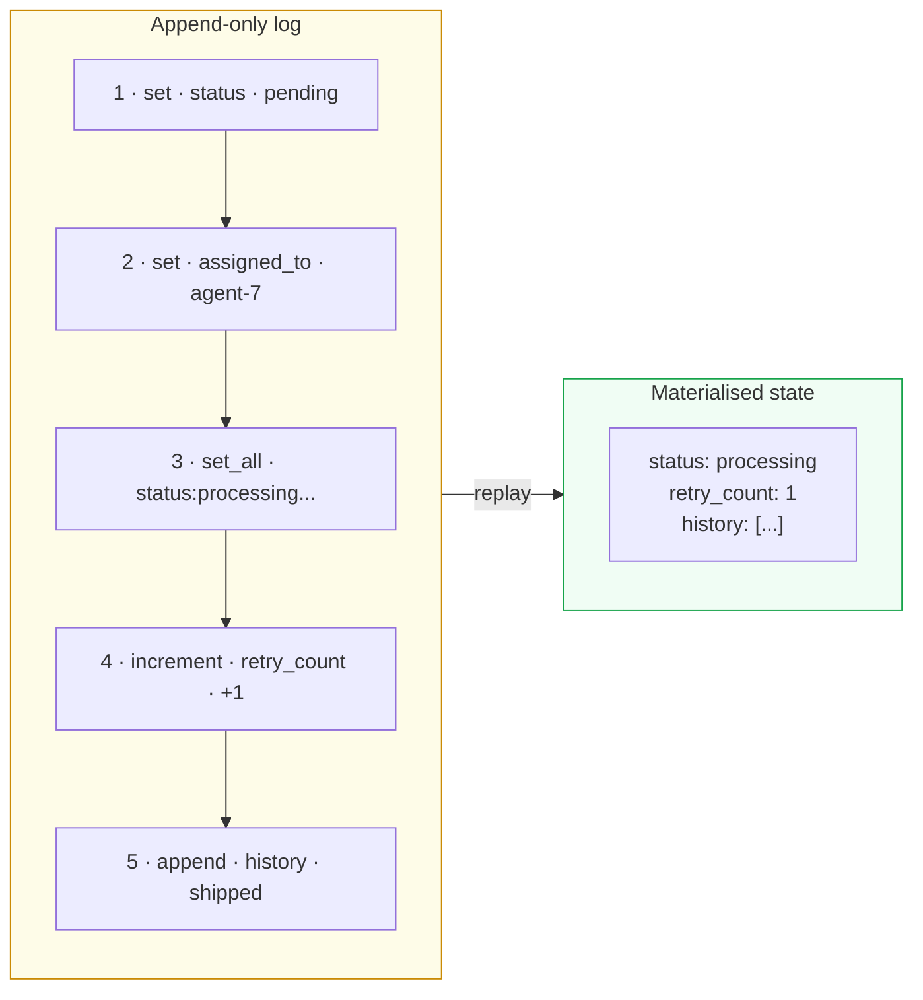
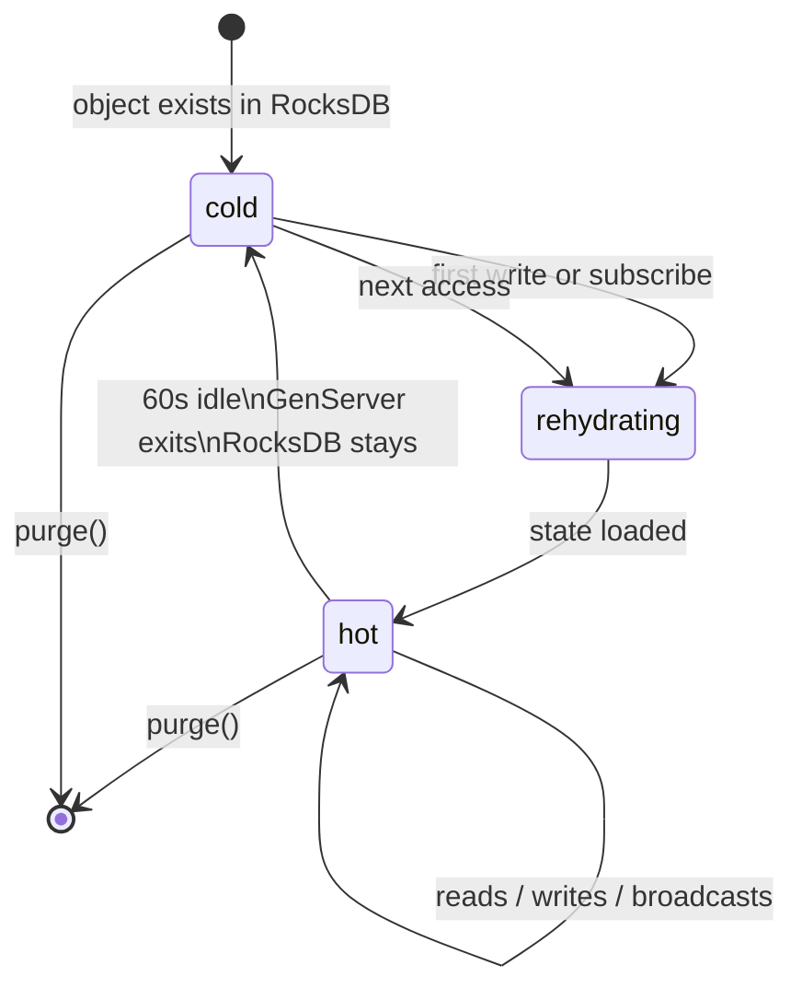
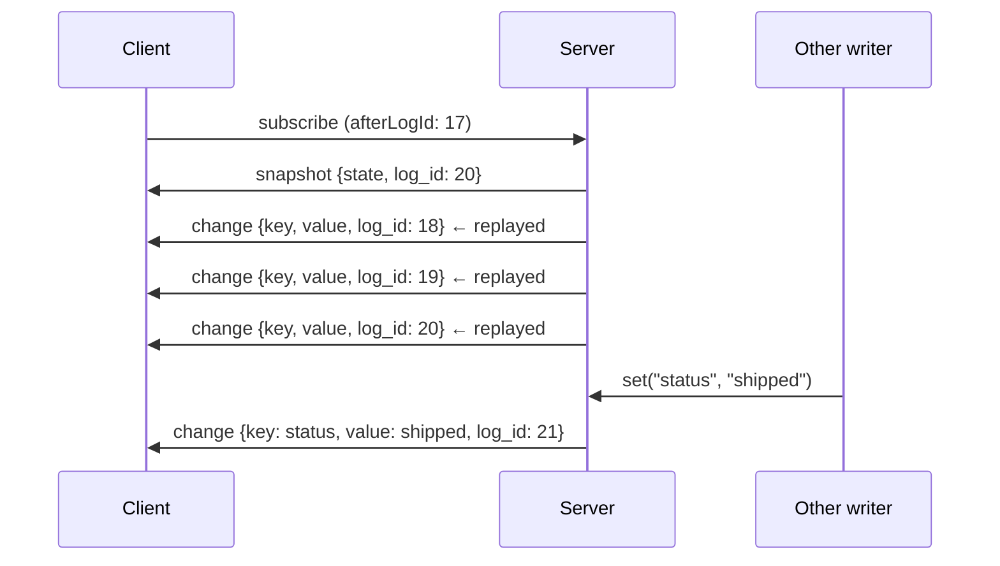
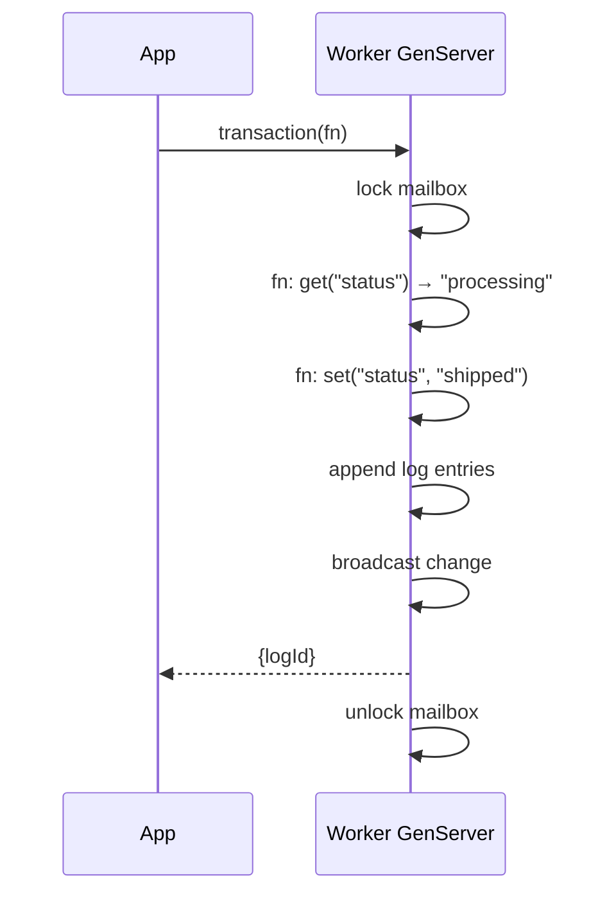

# Core Concepts

## State slots

An object's **state** is a flat map of named slots. Each slot holds any JSON-serialisable value.

```js
{
  "status":      "processing",
  "assigned_to": "agent-7",
  "retry_count": 2,
  "history":     [{ "event": "created", "at": 1718884800000 }]
}
```

Slots are created on first write and deleted explicitly. No schema required.

---

## The append-only log

Every write appends an immutable entry:



`log_id` is monotonically increasing, unique per object, returned on every write and included in every `change` event. State is rebuilt by replaying the log on restart — no data loss possible.

---

## Operations

| Operation | Description | Returns |
|---|---|---|
| `set(slot, value)` | Set a single slot | `{ logId }` |
| `setAll(map)` | Set multiple slots atomically | `{ logId }` |
| `get(slot)` | Read a single slot | value |
| `increment(slot, delta?)` | Atomic integer increment | `{ logId, value }` |
| `append(slot, item)` | Append to a list slot | `{ logId }` |
| `delete(slot)` | Remove a slot | `{ logId }` |
| `transaction(fn)` | Atomic read-modify-write | `{ logId }` |
| `state()` | Read full state map | object |

---

## Object lifecycle



Objects spring into existence on first write. There is no explicit create. `purge()` permanently deletes all state and log entries.

---

## Real-time subscriptions



Every subscriber receives changes in log order. `afterLogId` replays only missed entries — efficient RocksDB prefix scan, not a full scan.

---

## Transactions

Transactions are serialised by the Worker GenServer — only one runs at a time per object.



If the callback throws, no writes are committed.

---

## Consistency guarantees

- **Within one object**: all writes are linearised. `increment` and `transaction` are always atomic.
- **Across objects**: no cross-object transactions. Use an orchestrating process that writes sequentially.
- **Subscribers**: change events delivered in log order — a subscriber can never see log_id N+1 before N.
