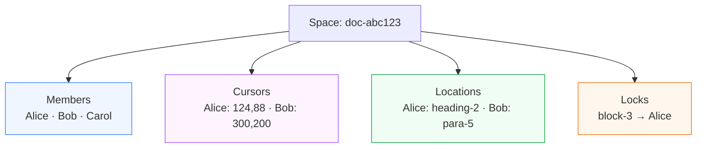
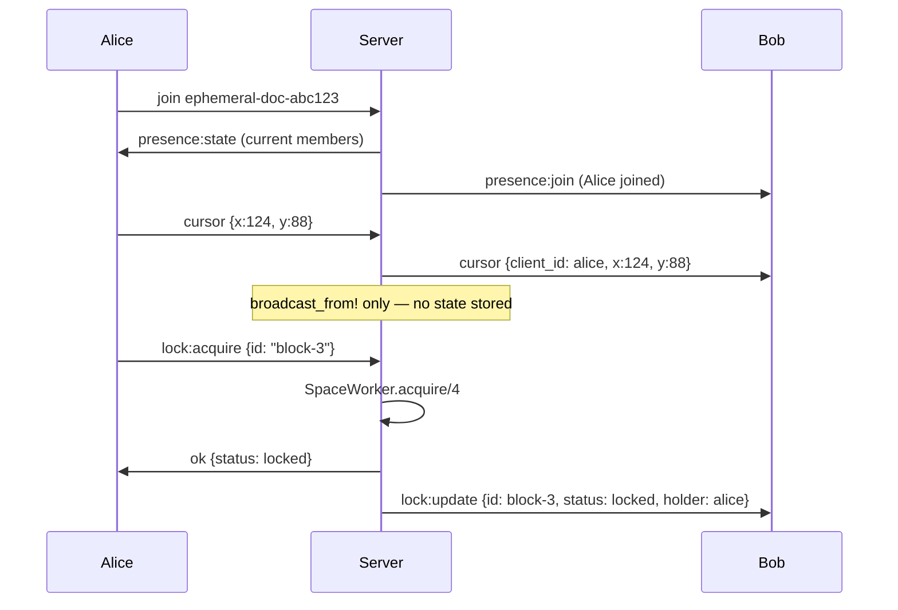

# Spaces

Real-time collaborative presence — cursors, members, locations, and locks.

## What it is

A Space is a named, ephemeral coordination context. No persistence — when the last member leaves, it's gone.

All state is **ephemeral**. Disconnecting removes presence, cursor, location, and held locks — automatically, no cleanup needed.

## The four primitives

| Primitive | Path | Overhead |
|---|---|---|
| **Members** | Phoenix Tracker → presence events | Low |
| **Cursors** | Pure relay (`broadcast_from!`), throttled 30fps | Zero |
| **Locations** | Pure relay (`broadcast_from!`) | Zero |
| **Locks** | SpaceWorker GenServer (serialised) | Low — lock events only |

Cursors and locations bypass any server-side state entirely. Locks are the only operation that touches a GenServer.

## Event flow

## When to use

- Collaborative document / code editors
- Multiplayer canvas or whiteboard
- Any UI where you want to show who's present and what they're doing

If you need persistence, use [Durable Objects](/docs/durable-objects/intro) instead.

---

**New here?** Start with the [Quickstart](./cookbook/quickstart).

**Know what you're looking for?** Jump to the [SDK Reference](./reference/sdk).
