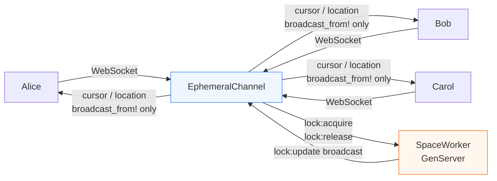
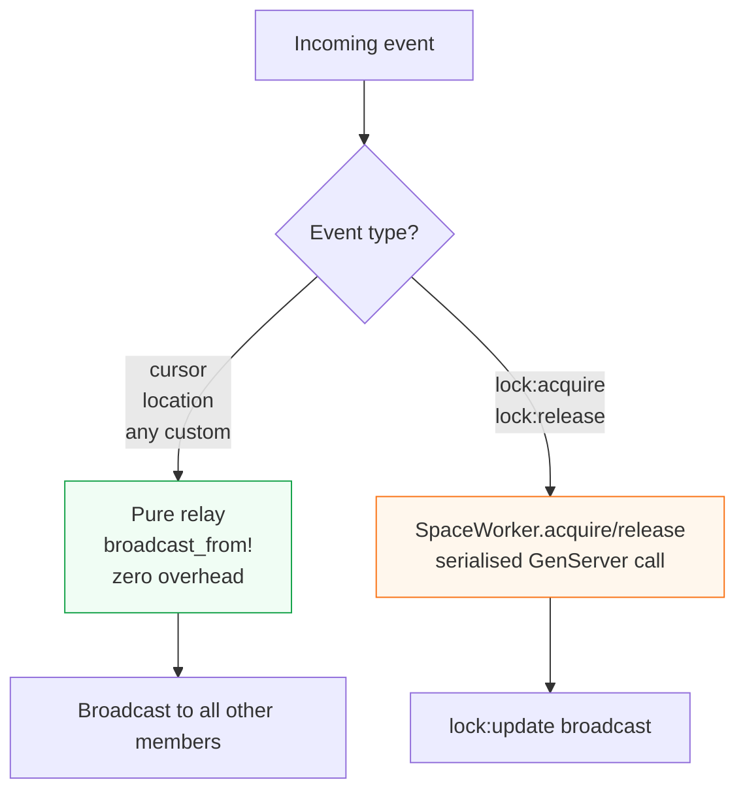
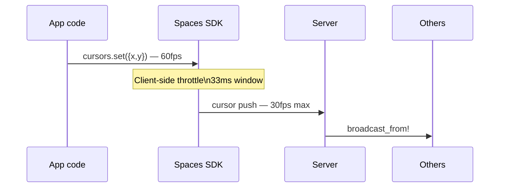
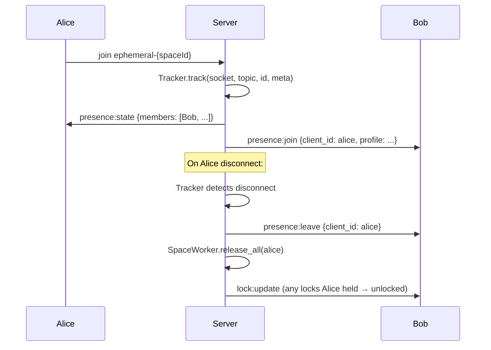
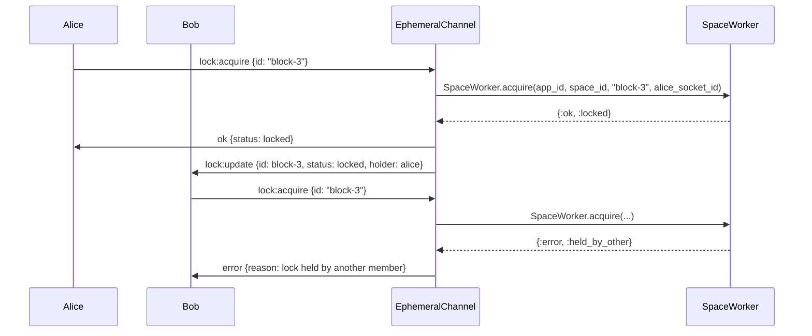
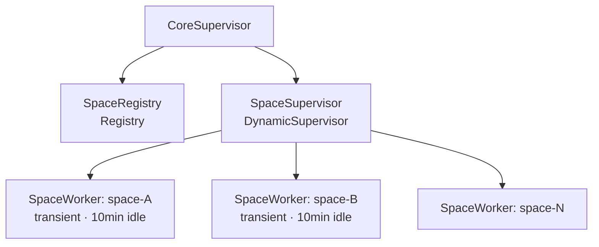

# Architecture

## Channel topology

All Spaces traffic flows over one Phoenix channel per space:

```
app:{appKey}:room:ephemeral-{spaceId}
```



---

## Two distinct paths



Cursors and locations **never** touch the SpaceWorker. At 100 members × 30fps = 3,000 events/sec, routing them through a single GenServer mailbox would be a guaranteed bottleneck.

---

## Cursor throttle



The throttle is enforced in the SDK. Intermediate positions within the 33ms window are dropped — only the latest is sent.

---

## Presence — Phoenix Tracker



No explicit cleanup needed — Tracker fires `presence:leave` and `terminate/2` releases locks on any disconnect, including crashes and network drops.

---

## Lock acquire / release



`SpaceWorker` is one GenServer per `{app_id, space_id}`. All lock operations are serialised through its mailbox. Lock state is **in-memory only** — no RocksDB, no WAL. A worker crash or node restart clears all locks (equivalent to all members disconnecting simultaneously).

---

## Supervision tree



`SpaceWorker` is `:transient` — not restarted on crash. Next lock acquire starts a fresh worker with an empty lock map. Members stay connected; only lock state is lost.

---

## Scale

| Dimension | Behaviour |
|---|---|
| Cursor fanout | O(n) `broadcast_from!` per space |
| Lock throughput | Limited by SpaceWorker mailbox — but lock events are rare vs cursors |
| Idle spaces | SpaceWorker exits after 10min; no persistent state |
| Max concurrent spaces | Unbounded — stateless relay + lazy GenServer |
